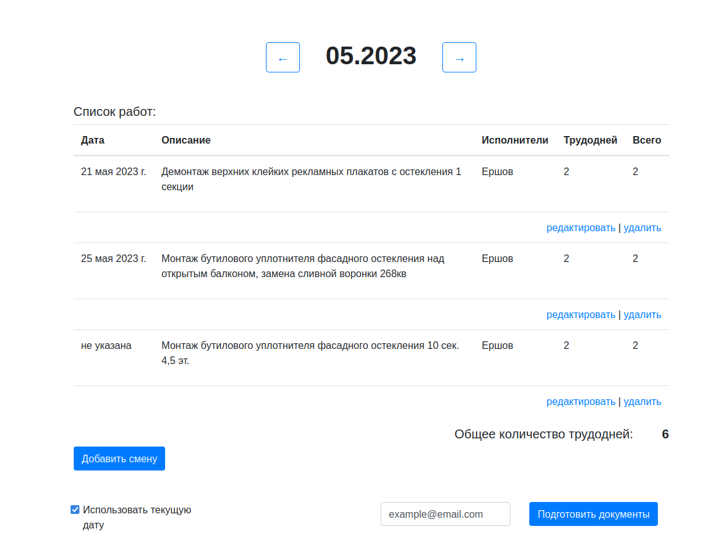
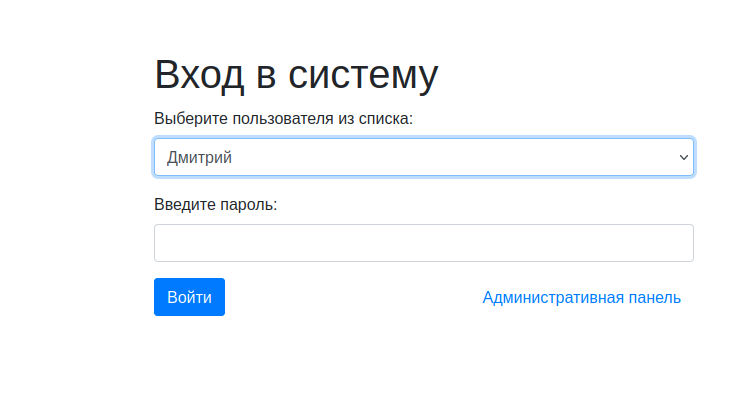
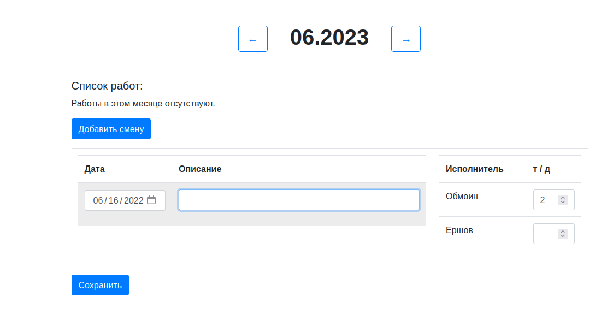
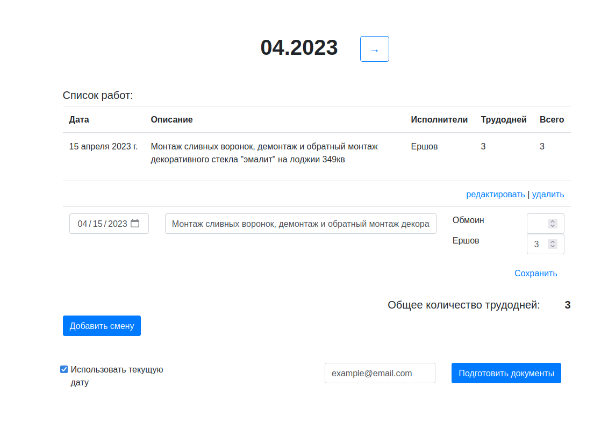

 # http://www.platinum-rope-access.ru/
 
A simple looking yet efficient web CRM, collecting and storing job reports for a residential complex management company, aiming to streamline the process of reporting and reports approval between the brigadier, the management company chief officer, and the contracted executor CEO.

The application provides role-specific functions for each type of user, ensuring they have access to the necessary tools and features for their role. 
It is designed to automatically send email notifications when a report is sent or approved, reducing manual communication and the risk of miscommunication.

The application has the ability to prepare monthly accounting documents such as invoices and certificates of completion with just one click, which greatly reduces the time and effort required for the monthly routine.

It provides an intuitive interface for reports themselves, making it easy for users of all technical levels to navigate and use the system effectively, and, at the same time, allows extensive configuration via admin panel for the roles in charge of the system operation.

## Roles
The web CRM allows each user to perform specific functionalities according to their role:

**The brigadier** can fill in job reports and send them directly from the application to the executor CEO. The application automatically collects the month report and sends it via email (smtp server at AWS).  
**The management company chief officer** can review and approve these reports. The approval triggers an email notification to the executor CEO.  
**The Executor CEO's** account provides a one-click decision to prepare monthly accounting documents, including invoice and certificate of completion (which includes the text version of report, payment and company details)

## Project Architecture

The project is built as a Django application leveraging Django's Model-View-Template (MVT) architecture. The Django views are used extensively for processing HTTP requests and controlling the flow of data between the PostgreSQL database and the Django web application.

**Backend**
On the backend, the system uses Django views for handling HTTP requests and interacting with the database. Both django's Class-Based Views and Function-Based Views are used to handle different requirements, ranging from processing form data to delivering JSON responses.

**Frontend**
The frontend uses Django templates. The dynamic and interactive content on the frontend is facilitated by JavaScript. The elements of interactivity include form validation and updating dynamically certain parts of the webpage without reloading.  
Bootstrap was involved to handle style and responsiveness.

**Database**
PostgreSQL is used for the database.

The database schema for this application consists of five models: Settings, Report, Worker, WorkerJobRecord, and JobRecord.  
_Settings_ acts as a system configuration panel, storing key variables like stake and reports_email. _Report_ manages monthly reports. _Worker_ represents individual workers with a unique name. _JobRecord_ contains details about each job, associated workers, and the report it belongs to, while _WorkerJobRecord_ links Worker and JobRecord, recording how many days each worker spent on a particular job.

**Deployment**
The project is set up for docker deployment. The application and its dependencies is packaged in a virtual container, thus speeding up the configuration and reducing the risk of problems occurring due to differences in dependencies or environments.

The Docker Compose file consists of three main services: postgres, nginx, and platinum.

The postgres service uses the official Postgres image and is responsible for handling the database.  
The nginx service is based on the lightweight Nginx Alpine image, acting as a reverse proxy for routing and load balancing, and serves static files.  
The platinum service is where our Django application resides. This service depends on the postgres service and interacts with it to perform operations on the database.

These services are isolated yet interconnected, each with a specific responsibility, ensuring high efficiency and fault tolerance. PostgreSQL data and static files are stored in Docker volumes, maintaining the data preservation in case of restarts.

